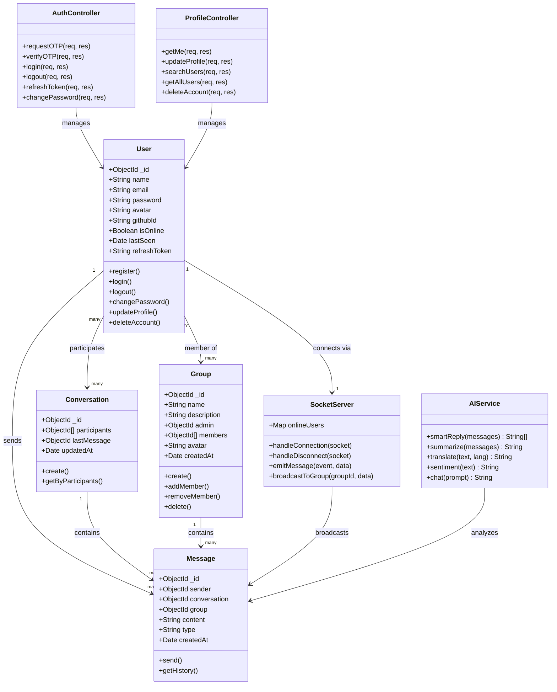
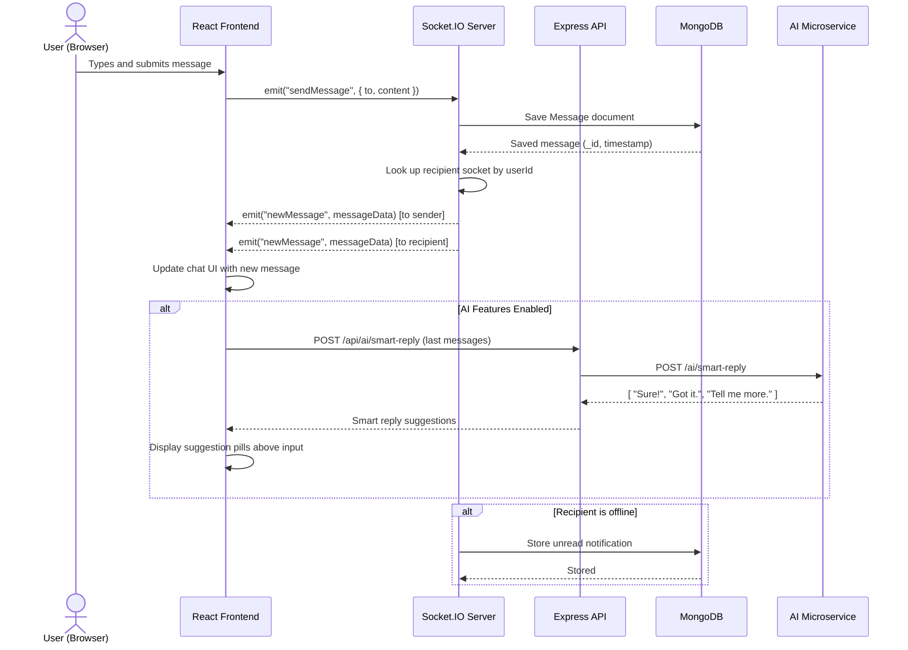
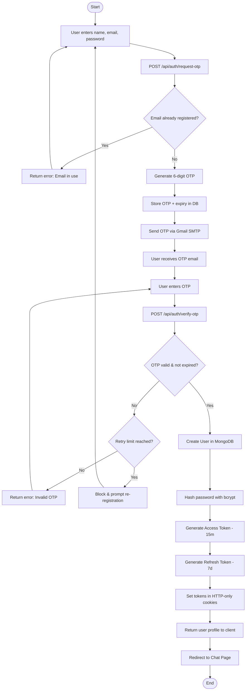

# ChatConnect — AI-Powered Real-Time Chat Application

> A full-stack real-time communication platform with AI-driven features, built as a mini project.

---

## Description

ChatConnect is a modern, full-stack real-time messaging application that combines group chat, one-to-one messaging, and AI-powered communication tools in a single platform. Built with a scalable microservices architecture, it delivers low-latency messaging via WebSockets, intelligent reply suggestions, sentiment analysis, and automated conversation summarization — all within a clean, responsive interface.

The project demonstrates industry-level system design using Node.js, React, Socket.IO, and a Python/FastAPI AI microservice powered by Groq's LLaMA model.

---

## Features

### Real-Time Messaging
- One-to-one direct messaging with live delivery
- Group chat creation and management
- Typing indicators and online/offline presence
- Message history with persistent storage (MongoDB)

### AI-Powered Enhancements
- **Smart Replies** — AI-generated reply suggestions after each message
- **Sentiment Analysis** — real-time emotional tone detection on messages
- **Conversation Summarization** — summarize long chat threads instantly
- **Message Translation** — translate messages to other languages
- **AI Chat Assistant** — context-aware assistant within the chat interface

### User & Profile Management
- OTP-based email registration (two-step verification)
- JWT authentication with access + refresh token flow
- Profile update, avatar upload (Cloudinary), and email change
- GitHub OAuth login via Passport.js
- Password change and account deletion

### Notifications & Search
- Live unread message badge via Socket.IO events
- Deep-link notifications that jump directly to the relevant chat
- Search users and groups with recent search history (localStorage)

---

## Tech Stack

| Layer | Technology |
|---|---|
| Frontend | React, Vite, Tailwind CSS, Axios, React Router |
| Backend | Node.js (ESM), Express 5, Mongoose, Socket.IO |
| AI Microservice | Python, FastAPI, Groq (LLaMA 3.3 70B) |
| Database | MongoDB Atlas |
| Auth | JWT, Passport.js (GitHub OAuth), Nodemailer (OTP) |
| Media | Cloudinary |
| Real-Time | Socket.IO (WebSockets) |

---

## System Architecture

## UML Diagrams

### Use Case Diagram

```mermaid
graph TD
    Actor([User])

    subgraph Authentication
        UC1[Register with OTP]
        UC2[Login with Email & Password]
        UC3[Login with GitHub OAuth]
        UC4[Logout]
        UC5[Change Password]
        UC6[Refresh Token]
    end

    subgraph Profile Management
        UC7[View & Edit Profile]
        UC8[Upload Avatar]
        UC9[Change Email]
        UC10[Set Online Status]
        UC11[Delete Account]
    end

    subgraph Messaging
        UC12[Send Direct Message]
        UC13[View Message History]
        UC14[Create Group]
        UC15[Send Group Message]
        UC16[Join / Leave Group]
        UC17[See Typing Indicator]
        UC18[See Online Users]
    end

    subgraph AI Features
        UC19[Get Smart Reply Suggestions]
        UC20[Analyze Message Sentiment]
        UC21[Summarize Conversation]
        UC22[Translate Message]
        UC23[Chat with AI Assistant]
    end

    subgraph Notifications & Search
        UC24[Receive Real-Time Notifications]
        UC25[Search Users & Groups]
        UC26[View Notification Feed]
    end

    Actor --> UC1
    Actor --> UC2
    Actor --> UC3
    Actor --> UC4
    Actor --> UC5
    Actor --> UC6
    Actor --> UC7
    Actor --> UC8
    Actor --> UC9
    Actor --> UC10
    Actor --> UC11
    Actor --> UC12
    Actor --> UC13
    Actor --> UC14
    Actor --> UC15
    Actor --> UC16
    Actor --> UC17
    Actor --> UC18
    Actor --> UC19
    Actor --> UC20
    Actor --> UC21
    Actor --> UC22
    Actor --> UC23
    Actor --> UC24
    Actor --> UC25
    Actor --> UC26
```

---

### Class Diagram

---

### Sequence Diagram

> **Scenario: User sends a direct message**

---

### Activity Diagram

> **Scenario: User Registration (OTP Flow)**

---

## License

MIT License

Copyright (c) 2025 Aditya Raut

Permission is hereby granted, free of charge, to any person obtaining a copy of this software and associated documentation files (the "Software"), to deal in the Software without restriction, including without limitation the rights to use, copy, modify, merge, publish, distribute, sublicense, and/or sell copies of the Software, and to permit persons to whom the Software is furnished to do so, subject to the following conditions:

The above copyright notice and this permission notice shall be included in all copies or substantial portions of the Software.

THE SOFTWARE IS PROVIDED "AS IS", WITHOUT WARRANTY OF ANY KIND, EXPRESS OR IMPLIED, INCLUDING BUT NOT LIMITED TO THE WARRANTIES OF MERCHANTABILITY, FITNESS FOR A PARTICULAR PURPOSE AND NONINFRINGEMENT. IN NO EVENT SHALL THE AUTHORS OR COPYRIGHT HOLDERS BE LIABLE FOR ANY CLAIM, DAMAGES OR OTHER LIABILITY, WHETHER IN AN ACTION OF CONTRACT, TORT OR OTHERWISE, ARISING FROM, OUT OF OR IN CONNECTION WITH THE SOFTWARE OR THE USE OR OTHER DEALINGS IN THE SOFTWARE.

---

## Developer

**Aditya Raut**
Mini Project — 2025
