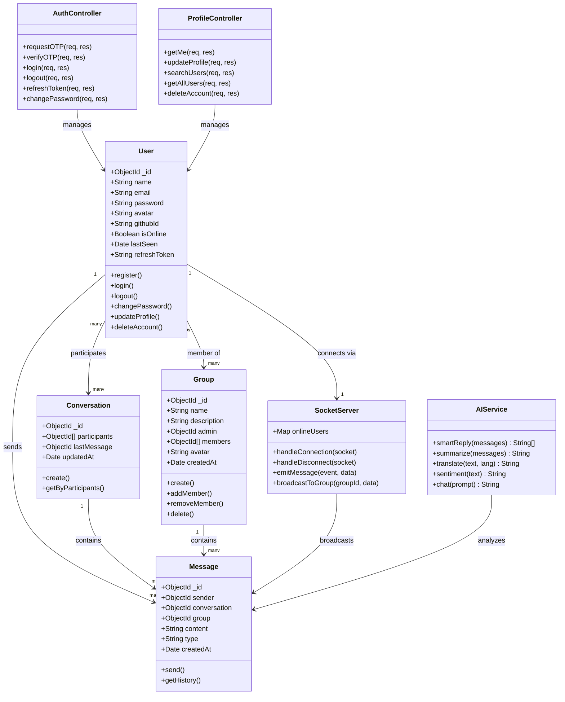
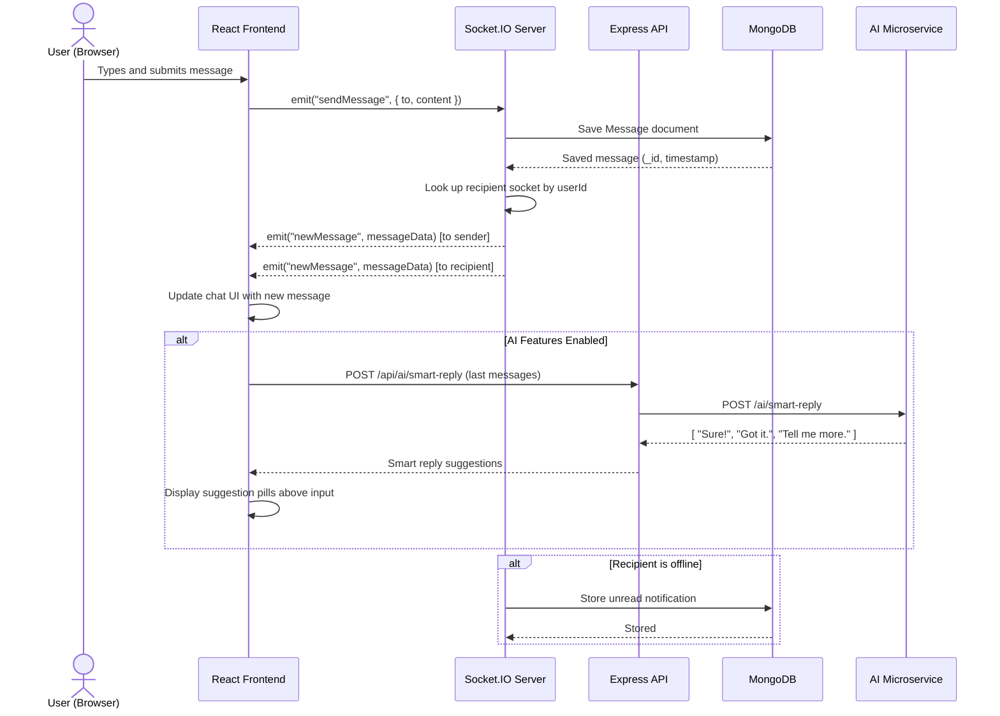

# ChatConnect — AI-Powered Real-Time Chat Application

> A full-stack real-time communication platform with AI-driven features, built as a mini project.

---

## Description

ChatConnect is a modern, full-stack real-time messaging application that combines group chat, one-to-one messaging, and AI-powered communication tools in a single platform. Built with a scalable microservices architecture, it delivers low-latency messaging via WebSockets, intelligent reply suggestions, sentiment analysis, and automated conversation summarization — all within a clean, responsive interface.

The project demonstrates industry-level system design using Node.js, React, Socket.IO, and a Python/FastAPI AI microservice powered by Groq's LLaMA model.

---

## Features

### Real-Time Messaging
- One-to-one direct messaging with live delivery
- Group chat creation and management
- Typing indicators and online/offline presence
- Message history with persistent storage (MongoDB)

### AI-Powered Enhancements
- **Smart Replies** — AI-generated reply suggestions after each message
- **Sentiment Analysis** — real-time emotional tone detection on messages
- **Conversation Summarization** — summarize long chat threads instantly
- **Message Translation** — translate messages to other languages
- **AI Chat Assistant** — context-aware assistant within the chat interface

### User & Profile Management
- OTP-based email registration (two-step verification)
- JWT authentication with access + refresh token flow
- Profile update, avatar upload (Cloudinary), and email change
- GitHub OAuth login via Passport.js
- Password change and account deletion

### Notifications & Search
- Live unread message badge via Socket.IO events
- Deep-link notifications that jump directly to the relevant chat
- Search users and groups with recent search history (localStorage)

---

## Tech Stack

| Layer | Technology |
|---|---|
| Frontend | React, Vite, Tailwind CSS, Axios, React Router |
| Backend | Node.js (ESM), Express 5, Mongoose, Socket.IO |
| AI Microservice | Python, FastAPI, Groq (LLaMA 3.3 70B) |
| Database | MongoDB Atlas |
| Auth | JWT, Passport.js (GitHub OAuth), Nodemailer (OTP) |
| Media | Cloudinary |
| Real-Time | Socket.IO (WebSockets) |

---

## System Architecture

```
Browser (React + Vite)
       │  HTTP/REST (Axios)    WebSocket (Socket.IO)
       ▼                               ▼
  Express 5 API  ◄──────────────  Socket.IO Server
  (Node.js ESM)                    (same process)
       │                               │
       ├── JWT Auth Middleware         │
       ├── /api/auth                   │
       ├── /api/profile                ▼
       ├── /api/messages          MongoDB Atlas
       ├── /api/groups            (Mongoose ODM)
       ├── /api/friends
       ├── /api/dashboard
       └── /api/ai  ──► FastAPI AI Microservice (Python)
                              └── Groq LLaMA 3.3 70B
```

---

## Modules

### 1. User Interface

**Pages:**

| Page | Purpose |
|---|---|
| `Login` / `Register` | OTP two-step registration, GitHub OAuth callback |
| `ChatPage` | Real-time DM + group messaging |
| `Profile` | Tabbed settings — avatar, email, password, danger zone |
| `Dashboard` | Home screen post-login |
| `Search` | User/group search with localStorage recent history |
| `Notification` | Live notification feed with chat deep-links |
| `VideoRoom` | WebRTC video call room |
| `UserProfile` | Public profile view of other users |

**Key Components:**

| Component | Purpose |
|---|---|
| `ChatPage` | Message list, typing indicator, online status display |
| `CreateGroupModal` / `ManageGroupModal` | Group creation and member management |
| `AIPanel` | AI assistant panel in chat header |
| `SmartReply` | AI-generated reply pills above message input |
| `VideoCallModal` | 1:1 WebRTC call UI |
| `GroupVideoCall` | Group video call UI |
| `Sidebar` | Navigation — chat, search, notifications, profile |

**State Management (React Contexts):**

| Context | Manages |
|---|---|
| `AuthContext` | User session, JWT tokens |
| `SocketContext` | Socket.IO connection lifecycle |
| `NotificationContext` | Live unread badge count |
| `AIContext` | AI feature enabled/disabled toggles |
| `CallContext` / `GroupCallContext` | WebRTC signaling for video calls |
| `FriendContext` | Friend request state |
| `ThemeContext` | Dark/light mode |

---

### 2. Backend Logic

**Entry point:** `backend/main.js` — Express 5 + `http.createServer` + Socket.IO init

**Controllers:**

| Controller | Responsibility |
|---|---|
| `auth.controller.js` | OTP request/verify, login, logout, refresh token, change password |
| `profile.controller.js` | getMe, update profile, search users, list all, delete account |
| `message.controller.js` | DM history, group history, conversations list |
| `group.controller.js` | Create/read/update/delete groups, add/remove members |
| `friend.controller.js` | Send, accept, reject friend requests |
| `ai.controller.js` | JWT-protected proxy to Python AI microservice |
| `dashboard.controller.js` | Dashboard data aggregation |

**API Routes:**

```
POST  /api/auth/request-otp
POST  /api/auth/verify-otp
POST  /api/auth/login
POST  /api/auth/logout          (protected)
POST  /api/auth/refresh-token
PUT   /api/auth/change-password (protected)

GET   /api/profile/search       (public)
GET   /api/profile/all          (public)
GET   /api/profile/me           (protected)
PUT   /api/profile/update       (protected)
DELETE /api/profile/delete      (protected)
GET   /api/profile/:userId      (public)

GET   /api/messages/dm/:userId
GET   /api/messages/group/:groupId
GET   /api/messages/conversations

POST  /api/groups               (create)
GET   /api/groups/my
PUT   /api/groups/:id/members
DELETE /api/groups/:id

POST  /api/ai/smart-reply       (protected, proxied to FastAPI)
POST  /api/ai/summarize
POST  /api/ai/translate
POST  /api/ai/sentiment
POST  /api/ai/chat
```

**Real-Time (Socket.IO):** `backend/socket/socket.js`
- JWT auth on handshake via `socket.handshake.auth.token`
- Online users tracked in server-side `Map`
- Events: `sendMessage`, `sendGroupMessage`, `joinGroup`, `leaveGroup`, `typing`, `stopTyping`, `newMessage`, `newGroupMessage`

**AI Microservice:** `server/server.py` (FastAPI, port 8000)
- `server/routers/ai_router.py` — route definitions
- `server/services/llm_service.py` — Groq LLaMA 3.3 70B API calls
- `server/services/agent_service.py` — agent-style conversational AI

---

### 3. Database

**Database:** MongoDB Atlas via Mongoose ODM — `backend/db/ConnectDB.js`

**Models:**

| Model | Key Fields |
|---|---|
| `User` | `name`, `email`, `password` (bcrypt), `avatar` (Cloudinary URL), `githubId`, `isOnline`, `lastSeen`, `refreshToken` |
| `Message` | `sender` (ref User), `conversation` (ref Conversation), `group` (ref Group), `content`, `type`, `createdAt` |
| `Conversation` | `participants[]` (ref User), `lastMessage` (ref Message), `updatedAt` |
| `Group` | `name`, `description`, `admin` (ref User), `members[]` (ref User), `avatar` |
| `FriendRequest` | `sender` (ref User), `receiver` (ref User), `status` (pending/accepted/rejected) |

**Relationships:**
- User → many Messages (sender)
- User ↔ many Conversations (participants array)
- User ↔ many Groups (members array)
- Conversation → many Messages
- Group → many Messages

---

### 4. Integration

**Authentication Flow:**
1. User submits name, email, password → `POST /api/auth/request-otp`
2. Server generates 6-digit OTP, stores with expiry in DB, sends via Gmail SMTP (Nodemailer)
3. User submits OTP → `POST /api/auth/verify-otp`
4. Server validates OTP → creates User → issues JWT access token (15m) + refresh token (7d) in HTTP-only cookies
5. GitHub OAuth via Passport.js → frontend callback at `/auth/callback`

**Real-Time Messaging Flow:**
1. Client connects Socket.IO with JWT token in handshake auth
2. `emit("sendMessage", { to, content })` → server saves Message to MongoDB
3. Server emits `newMessage` to both sender and recipient sockets
4. `NotificationContext` listens → increments unread badge
5. `ChatPage` reads `location.state.openChat` / `location.state.openGroup` to auto-open correct chat

**AI Integration Flow:**
1. After each message (when AI enabled), frontend calls `POST /api/ai/smart-reply`
2. Node proxy forwards to FastAPI with the last N messages as context
3. Groq LLaMA 3.3 70B returns suggestions → displayed as pill buttons above chat input
4. AI Panel supports: summarize thread, translate message, sentiment analysis, freeform assistant chat

**Media Upload (Cloudinary):**
- Profile avatar uploaded as multipart form → Cloudinary → URL stored in `user.avatar`
- Group avatars follow the same pattern

**Video Calls (WebRTC):**
- `CallContext` (1:1) and `GroupCallContext` (group) manage peer connections
- Socket.IO used for WebRTC signaling: offer, answer, ICE candidates
- `VideoCallModal` and `GroupVideoCall` components handle UI + stream management

**Deployment:**
- `docker-compose.yml` orchestrates all three services: Node backend, React client, FastAPI AI server
- Each service has its own `Dockerfile` + `.dockerignore`
- Backend deployed to Vercel (`backend/vercel.json`); client to Vercel (`client/vercel.json`)

---

## UML Diagrams

### Use Case Diagram


---

### Class Diagram



---

### Sequence Diagram

> **Scenario: User sends a direct message**



---

### Activity Diagram

> **Scenario: User Registration (OTP Flow)**


---

## License

MIT License

Copyright (c) 2025 Aditya Raut

Permission is hereby granted, free of charge, to any person obtaining a copy of this software and associated documentation files (the "Software"), to deal in the Software without restriction, including without limitation the rights to use, copy, modify, merge, publish, distribute, sublicense, and/or sell copies of the Software, and to permit persons to whom the Software is furnished to do so, subject to the following conditions:

The above copyright notice and this permission notice shall be included in all copies or substantial portions of the Software.

THE SOFTWARE IS PROVIDED "AS IS", WITHOUT WARRANTY OF ANY KIND, EXPRESS OR IMPLIED, INCLUDING BUT NOT LIMITED TO THE WARRANTIES OF MERCHANTABILITY, FITNESS FOR A PARTICULAR PURPOSE AND NONINFRINGEMENT. IN NO EVENT SHALL THE AUTHORS OR COPYRIGHT HOLDERS BE LIABLE FOR ANY CLAIM, DAMAGES OR OTHER LIABILITY, WHETHER IN AN ACTION OF CONTRACT, TORT OR OTHERWISE, ARISING FROM, OUT OF OR IN CONNECTION WITH THE SOFTWARE OR THE USE OR OTHER DEALINGS IN THE SOFTWARE.

---

## Developer

**Aditya Raut**
Mini Project — 2025
