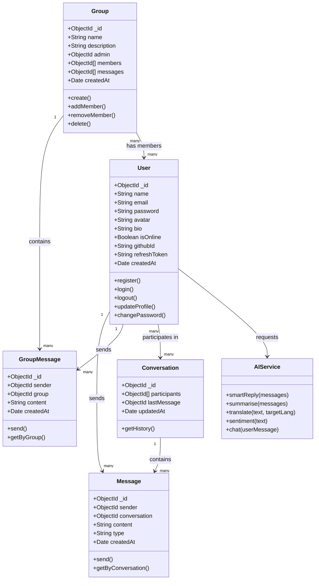
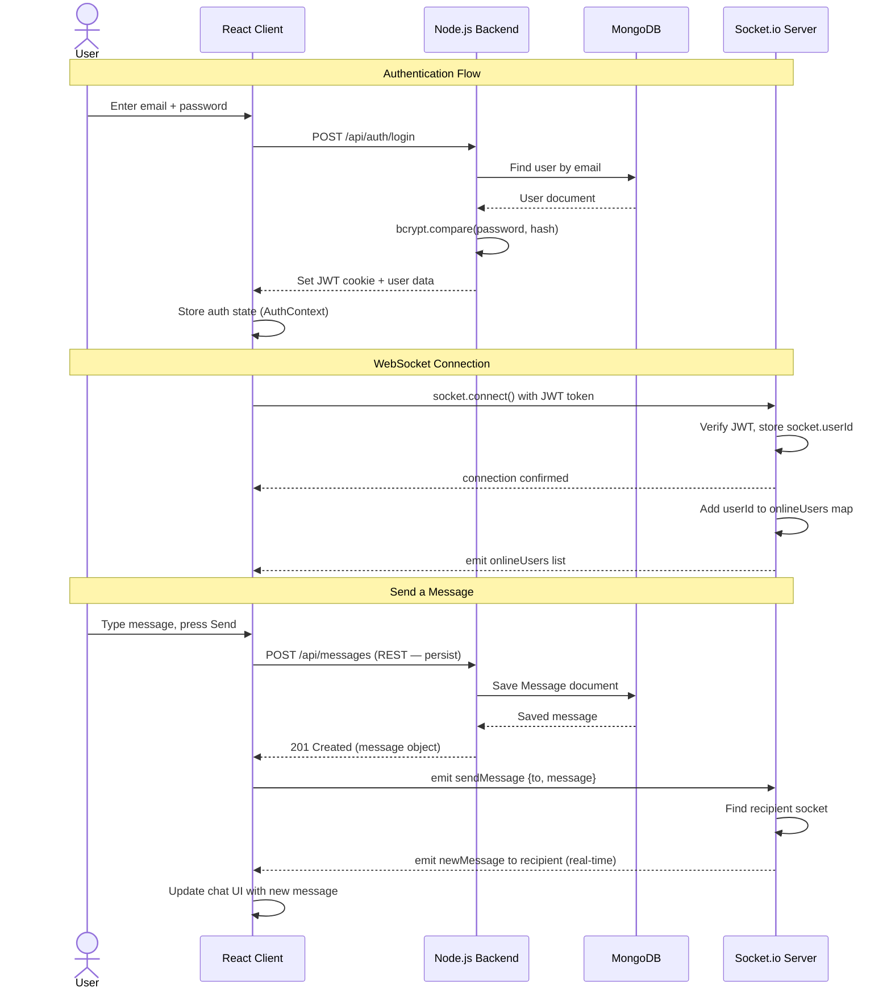
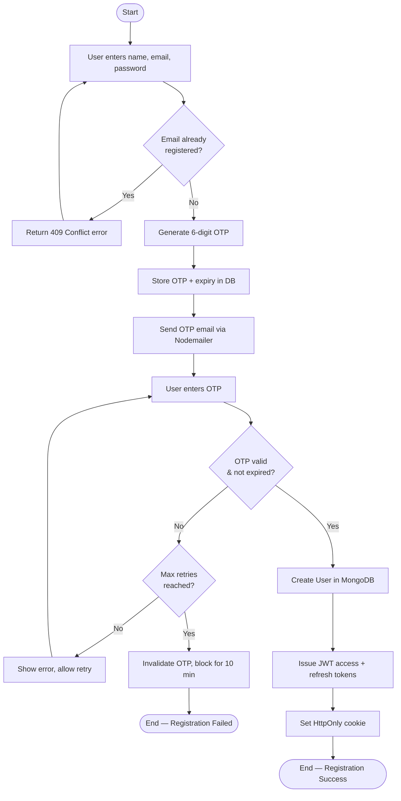
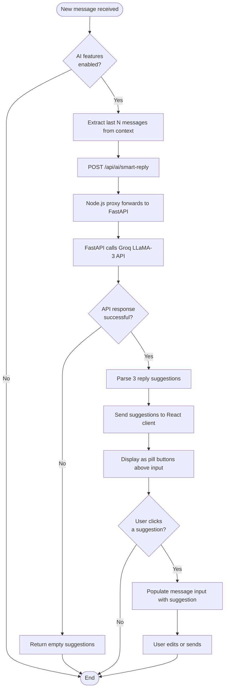

# System Design & Diagrams

## 1. Architecture Diagram

ChatsConnect follows a **three-tier client-server architecture** augmented with an AI microservice:

```
┌─────────────────────────────────────────────────────────────┐
│                        CLIENT TIER                          │
│   React 19 + Vite 7 SPA  (Vercel CDN)                      │
│   ┌──────────┐  ┌──────────┐  ┌──────────┐  ┌──────────┐  │
│   │  Auth    │  │  Chat    │  │  Video   │  │  AI      │  │
│   │  Pages   │  │  Pages   │  │  Call    │  │  Panel   │  │
│   └──────────┘  └──────────┘  └──────────┘  └──────────┘  │
└─────────────────┬───────────────────┬───────────────────────┘
                  │ HTTPS REST        │ WebSocket (Socket.io)
                  │                   │
┌─────────────────▼───────────────────▼───────────────────────┐
│                      SERVER TIER                             │
│   Node.js + Express 5  (Vercel Serverless / Node server)    │
│   ┌──────────┐  ┌──────────┐  ┌──────────┐  ┌──────────┐  │
│   │  Auth    │  │ Message  │  │  Group   │  │  AI      │  │
│   │ Routes   │  │ Routes   │  │  Routes  │  │  Proxy   │  │
│   └──────────┘  └──────────┘  └──────────┘  └──────┬───┘  │
│                  ┌──────────┐                        │       │
│                  │Socket.io │                        │       │
│                  │ Server   │                        │       │
│                  └──────────┘                        │       │
└───────────────────────┬──────────────────────────────┼───────┘
                        │ Mongoose ODM                  │ HTTP
                        │                               │
┌───────────────────────▼───────┐  ┌────────────────────▼──────┐
│         DATA TIER             │  │     AI MICROSERVICE        │
│   MongoDB Atlas               │  │   FastAPI + Uvicorn        │
│   ┌──────────────────────┐    │  │   (Python, Port 8000)      │
│   │ users  messages      │    │  │   ┌──────────────────────┐ │
│   │ convos groups        │    │  │   │ Groq API (LLaMA-3)   │ │
│   └──────────────────────┘    │  │   └──────────────────────┘ │
└───────────────────────────────┘  └────────────────────────────┘
         │ Cloudinary SDK                │ Gmail SMTP
         ▼                               ▼
   [Image Storage]                [OTP Email Delivery]
```

---

## 2. UML Diagrams

### 2.1 Use Case Diagram

```mermaid
graph TD
    Guest([Guest User])
    RegUser([Registered User])
    GroupAdmin([Group Admin])
    AIService([AI Microservice])

    Guest --> UC1[Register with OTP]
    Guest --> UC2[Login with Email/Password]
    Guest --> UC3[Login with GitHub OAuth]

    RegUser --> UC4[Send Direct Message]
    RegUser --> UC5[View Message History]
    RegUser --> UC6[See Typing Indicator]
    RegUser --> UC7[Start Video Call]
    RegUser --> UC8[Accept / Reject Call]
    RegUser --> UC9[Create Group Chat]
    RegUser --> UC10[Send Group Message]
    RegUser --> UC11[Update Profile]
    RegUser --> UC12[Search Users]
    RegUser --> UC13[View Notifications]
    RegUser --> UC14[Request Smart Reply]
    RegUser --> UC15[Summarise Conversation]
    RegUser --> UC16[Translate Message]
    RegUser --> UC17[Analyse Sentiment]
    RegUser --> UC18[Logout]

    GroupAdmin --> UC19[Add Member to Group]
    GroupAdmin --> UC20[Remove Member from Group]

    UC14 --> AIService
    UC15 --> AIService
    UC16 --> AIService
    UC17 --> AIService
```



---

### 2.2 Class Diagram



---

### 2.3 Sequence Diagram — User Login and Send Message



---

### 2.4 Activity Diagram — OTP Registration Flow



---

### 2.5 Activity Diagram — AI Smart Reply Flow


