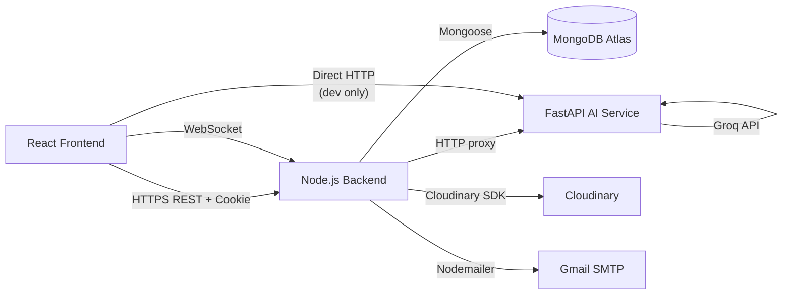

# Implementation

## 1. Technology Stack

ChatsConnect uses the **MERN stack** (MongoDB, Express, React, Node.js) extended with a **Python/FastAPI AI microservice**.

### Why MERN?

| Reason | Detail |
|---|---|
| JavaScript end-to-end | Shared data models and patterns between frontend and backend reduce context switching |
| Non-blocking I/O | Node.js excels at handling thousands of concurrent WebSocket connections |
| Flexible schema | MongoDB document model maps naturally to chat messages, users, and groups |
| Large ecosystem | npm ecosystem provides battle-tested packages for JWT, bcrypt, OAuth, and WebRTC |
| Rapid prototyping | Vite + React enables fast UI iteration with HMR (Hot Module Replacement) |

### Why FastAPI for AI?

| Reason | Detail |
|---|---|
| Python ecosystem | Best-in-class LLM client libraries (Groq SDK, OpenAI SDK) are Python-first |
| Async support | FastAPI + Uvicorn handle concurrent AI requests without blocking |
| Separation of concerns | AI service can be swapped or scaled independently of the Node.js backend |
| Developer speed | Automatic OpenAPI docs and Pydantic validation accelerate iteration |

---

## 2. Module Implementation

### 2.1 User Interface (Frontend)

**Location:** `client/`

The frontend is a React 19 single-page application (SPA) built with Vite 7.

#### Project Structure

```
client/
├── src/
│   ├── components/
│   │   ├── auth/          # Login, Register, OTP input forms
│   │   ├── chat/          # ChatPage, MessageBubble, TypingIndicator
│   │   ├── profile/       # ProfilePage, useProfileActions hook
│   │   ├── ai/            # AIPanel, SmartReply pill buttons
│   │   └── video/         # VideoCall, CallModal components
│   ├── context/
│   │   ├── AuthContext.jsx       # Global auth state
│   │   ├── SocketContext.jsx     # Socket.io connection
│   │   ├── NotificationContext.jsx # Unread badge counts
│   │   └── AIContext.jsx         # AI feature toggles
│   ├── pages/
│   │   ├── ChatPage.jsx          # Main chat page (reads location.state)
│   │   ├── NotificationPage.jsx  # Notification feed
│   │   └── Search.jsx            # User/group search with localStorage history
│   └── App.jsx                   # Provider tree + React Router routes
```

#### Key Implementation Details

- **AuthContext** — stores `user` object and `isAuthenticated` flag; auto-refreshes JWT using `POST /api/auth/refresh-token` on 401 responses.
- **SocketContext** — wraps `socket.io-client`; exposes `socket`, `onlineUsers`, and `isConnected` to the component tree.
- **NotificationContext** — listens to `newMessage` and `newGroupMessage` socket events; accumulates unread counts per conversation and resets when the chat is opened.
- **ChatPage** — reads `location.state.openChat` / `location.state.openGroup` passed via React Router navigate calls to auto-select conversations from notifications or search results.
- **SmartReply** — polls `POST /api/ai/smart-reply` after each incoming message when `aiEnabled=true`; renders 3 suggestions as clickable pill buttons above the message input.

#### Routing

```
/                → Landing / Home page
/login           → Login form
/register        → Multi-step OTP registration
/chat            → Main chat interface (protected)
/profile         → User profile editor (protected)
/notifications   → Notification feed (protected)
/search          → Search users and groups (protected)
```

---

### 2.2 Backend Logic

**Location:** `backend/`

The backend is a Node.js server using **Express 5** in ES Module mode (`"type": "module"`).

#### Project Structure

```
backend/
├── main.js                  # Entry point — HTTP server + Socket.io init
├── controllers/
│   ├── auth.controller.js   # register, login, logout, refresh, changePassword
│   ├── profile.controller.js # getMe, updateProfile, searchUsers, deleteAccount
│   ├── message.controller.js # getDMHistory, getGroupHistory, getConversations
│   ├── group.controller.js  # createGroup, addMember, removeMember, deleteGroup
│   └── ai.controller.js     # proxy to FastAPI AI endpoints
├── middleware/
│   └── auth.middleware.js   # protect: verify JWT, attach req.user
├── models/
│   ├── user.model.js
│   ├── message.model.js
│   ├── conversation.model.js
│   └── group.model.js
├── routes/
│   ├── auth.routes.js
│   ├── profile.routes.js
│   ├── message.routes.js
│   ├── group.routes.js
│   └── ai.routes.js
├── socket/
│   └── socket.js            # initSocket() — event handlers for chat + video
└── service/
    └── Nodemailer.js        # sendOTPEmail()
```

#### Authentication Flow

```js
// auth.middleware.js
const token = req.cookies.accessToken;
const decoded = jwt.verify(token, process.env.JWT_SECRET);
req.user = await User.findById(decoded.userId);
```

JWT tokens use `{ userId }` as payload. Access token expires in 15 minutes; refresh token in 7 days. Refresh tokens are stored in the user document and rotated on each use.

#### Socket.io Events

| Event (client → server) | Description |
|---|---|
| `sendMessage` | Persist DM, relay to recipient socket |
| `sendGroupMessage` | Persist group message, broadcast to group room |
| `joinGroup` | Add socket to Socket.io room for a group |
| `leaveGroup` | Remove socket from group room |
| `callUser` | Relay WebRTC offer signal to target user |
| `acceptCall` | Relay WebRTC answer signal back to caller |
| `endCall` | Notify the other party the call has ended |
| `typing` | Broadcast typing indicator to conversation partner |
| `stopTyping` | Stop typing indicator |

---

### 2.3 Database

**Location:** MongoDB Atlas (cloud) / local MongoDB for development

#### Collections and Schemas

**users**
```
{
  _id, name, email, password (bcrypt), avatar (Cloudinary URL),
  bio, isOnline, githubId, refreshToken, createdAt
}
```

**conversations**
```
{
  _id,
  participants: [userId, userId],
  lastMessage: messageId,
  updatedAt
}
```

**messages**
```
{
  _id,
  sender: userId,
  conversation: conversationId,
  content: String,
  type: "text" | "image",
  createdAt
}
```

**groups**
```
{
  _id,
  name, description,
  admin: userId,
  members: [userId],
  messages: [groupMessageId],
  createdAt
}
```

**groupmessages**
```
{
  _id,
  sender: userId,
  group: groupId,
  content: String,
  createdAt
}
```

#### Indexes

- `conversations`: compound index on `participants` for fast DM lookup.
- `messages`: index on `conversation` + `createdAt` for paginated history.
- `users`: unique index on `email`; sparse index on `githubId`.

---

### 2.4 AI Microservice

**Location:** `server/`

The AI microservice is a standalone **FastAPI** application that communicates with the Groq LLM API.

#### Project Structure

```
server/
├── server.py          # FastAPI app entry point
├── .env               # GROQ_API_KEY
└── env/               # Python virtual environment
```

#### API Endpoints

| Method | Endpoint | Description |
|---|---|---|
| GET | `/ai/health` | Health check |
| POST | `/ai/smart-reply` | Generate 3 reply suggestions from last N messages |
| POST | `/ai/summarise` | Produce a bullet-point summary of a conversation |
| POST | `/ai/translate` | Translate text to a target language |
| POST | `/ai/sentiment` | Return positive / neutral / negative label + confidence |
| POST | `/ai/chat` | General-purpose AI chat assistant |

#### Example: Smart Reply Implementation

```python
@app.post("/ai/smart-reply")
async def smart_reply(req: SmartReplyRequest):
    messages = req.messages  # list of {role, content}
    system_prompt = (
        "You are a messaging assistant. Given the conversation, "
        "suggest 3 short, natural reply options. Return JSON array only."
    )
    response = groq_client.chat.completions.create(
        model="llama-3.3-70b-versatile",
        messages=[{"role": "system", "content": system_prompt}, *messages],
        response_format={"type": "json_object"},
    )
    return {"suggestions": json.loads(response.choices[0].message.content)}
```

#### Node.js Proxy (ai.controller.js)

The Node.js backend forwards authenticated AI requests to the FastAPI service:

```js
export const smartReply = async (req, res) => {
  const response = await fetch(`${process.env.AI_SERVICE_URL}/ai/smart-reply`, {
    method: 'POST',
    headers: { 'Content-Type': 'application/json' },
    body: JSON.stringify(req.body),
  });
  const data = await response.json();
  res.json(data);
};
```

---

### 2.5 Integration

The four modules integrate as follows:



#### Integration Points

| Integration | Protocol | Auth |
|---|---|---|
| React ↔ Node.js REST | HTTPS + HttpOnly JWT cookie | JWT middleware |
| React ↔ Node.js Socket.io | WebSocket with JWT handshake token | `socket.handshake.auth.token` |
| Node.js ↔ MongoDB | Mongoose connection string | Atlas username + password |
| Node.js ↔ FastAPI | Internal HTTP (same server or localhost) | None (internal network) |
| Node.js ↔ Cloudinary | HTTPS with API key/secret | SDK credentials |
| Node.js ↔ Gmail SMTP | SMTP over TLS (port 587) | App Password |
| FastAPI ↔ Groq API | HTTPS | `GROQ_API_KEY` bearer token |

#### Running the Full Stack Locally

```bash
# 1. Start MongoDB (if local) or use Atlas connection string in .env

# 2. Start Node.js backend
cd backend
npm install
npm run dev          # runs on port 3000

# 3. Start AI microservice
cd server
./env/bin/python server.py    # runs on port 8000

# 4. Start React frontend
cd client
npm install
npm run dev          # runs on port 5173
```

#### Environment Variables

**backend/.env**
```
MONGODB_URI=
JWT_SECRET=
JWT_REFRESH_SECRET=
EMAIL_USER=
EMAIL_PASSWORD=
CLOUDINARY_CLOUD_NAME=
CLOUDINARY_API_KEY=
CLOUDINARY_API_SECRET=
GITHUB_CLIENT_ID=
GITHUB_CLIENT_SECRET=
AI_SERVICE_URL=http://localhost:8000
```

**server/.env**
```
GROQ_API_KEY=
```

**client/.env** *(development only)*
```
VITE_AI_API_URL=http://localhost:8000
```
