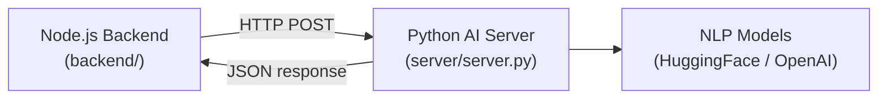

# AI Microservice — `server/`

The `server/` directory contains the foundation for a **Python-based AI microservice** (`server/server.py`). It is currently a stub and is planned to be developed into a standalone AI inference server that the Node.js backend can call via HTTP.

## Current State

```
server/
├── server.py      # Python server entry point (stub)
└── env/           # Python virtual environment
```

The microservice is **not yet integrated** with the main backend. It is a planned extension of the platform.

## Planned Architecture



## Planned Capabilities

### 1. Smart Reply Suggestions
Based on the last few messages in a conversation, the service will suggest short contextual reply options displayed above the chat input box.

### 2. Automated Chat Summarisation
For long group conversations, the service will produce a short summary and extract key action items — accessible from a sidebar panel.

### 3. Sentiment Analysis
Each message can be scored for sentiment (positive / negative / neutral) to display community health dashboards or warn users about tone.

### 4. Message Moderation
Before persisting or broadcasting a message, the backend can call the AI service to check for toxic or abusive content.

## Planned API Contract

When implemented, the backend will call these endpoints:

| Method | Endpoint | Input | Output |
|--------|----------|-------|--------|
| POST | `/analyze-sentiment` | `{ "text": "..." }` | `{ "sentiment": "positive", "score": 0.92 }` |
| POST | `/suggest-replies` | `{ "history": [...] }` | `{ "replies": ["Sure!", "Sounds good", "Let me check"] }` |
| POST | `/summarize` | `{ "messages": [...] }` | `{ "summary": "...", "action_items": [...] }` |
| POST | `/moderate` | `{ "text": "..." }` | `{ "isSafe": true }` |

## Development Setup

```bash
cd server
python -m venv env
source env/bin/activate    # Windows: env\Scripts\activate
pip install fastapi uvicorn transformers
uvicorn server:app --reload --port 8000
```

## Frontend Integration (Planned)

The `components/ai/` directory in the client is the UI placeholder waiting for this service:
- Smart reply chips above the chat input box.
- "Summarise this conversation" button in the chat panel.
- Sentiment indicator on conversation list items.
