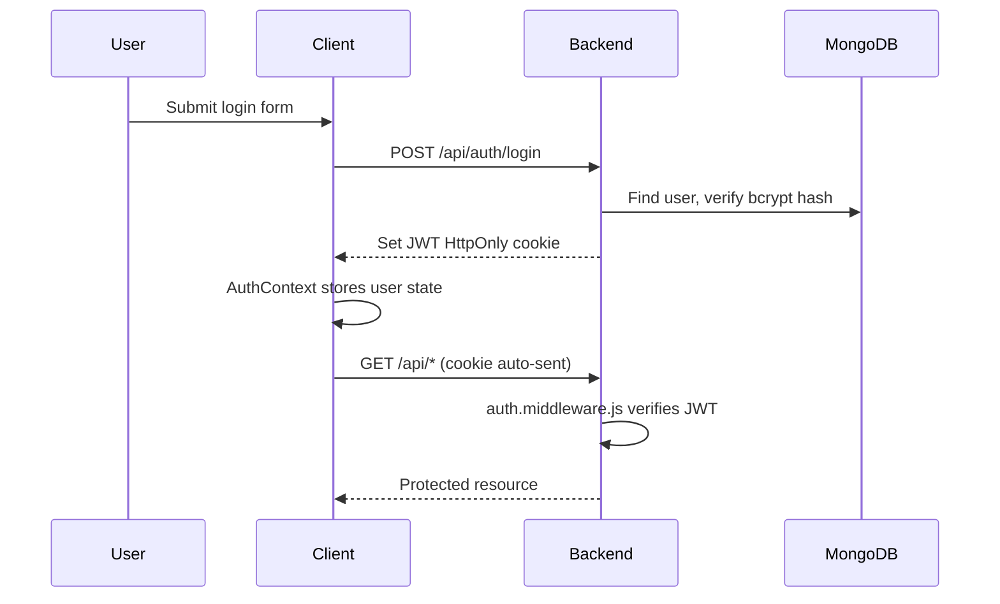

# Architecture Overview

**ChatsConnect** is a full-stack real-time chat application with friend management, group messaging, video calling, AI assistance, and profile management. It follows a **client-server architecture** with WebSocket support for real-time events.


## System Topology


## Project Root Layout

```
MiniProject/
├── backend/     # Node.js + Express REST API & Socket.io server
├── client/      # React 19 + Vite 7 SPA
├── server/      # Python server stub (AI placeholder)
└── docs/        # This Docusaurus documentation site
```

## Component Summary

| Component | Technology | Hosted On |
|-----------|-----------|-----------|
| Frontend | React 19, Vite 7, TailwindCSS 4, React Router 7 | Vercel |
| Backend | Node.js, Express 5, Socket.io 4, Mongoose | Vercel |
| Database | MongoDB | MongoDB Atlas |
| Media Storage | Cloudinary SDK | Cloudinary |
| Email | Nodemailer | SMTP |
| OAuth | Passport + GitHub Strategy | GitHub |

## Core Data Flow

### 1. Authentication
1. User registers/logs in via REST `POST /api/auth/login`.
2. Backend verifies credentials with **Bcryptjs** and issues a **JWT** stored in an **HttpOnly cookie**.
3. GitHub OAuth is handled via **Passport.js** strategy; on callback, a JWT cookie is equally issued.
4. Every protected API request passes through `auth.middleware.js` which verifies the JWT.

### 2. Real-Time Messaging
1. On login, the client establishes a **Socket.io WebSocket** connection (authenticated via cookie).
2. The socket server tracks **online users** in an in-memory map.
3. When a user opens a conversation, the client emits `joinRoom(conversationId)`.
4. Messages sent via `sendMessage` are saved to MongoDB and **broadcast** to all room participants.

### 3. Video Calling
1. Caller emits `callUser(targetUserId, signal)` via Socket.io.
2. Server relays `incomingCall` to the target.
3. Target accepts → emits `acceptCall(signal)` → server relays `callAccepted` back.
4. Clients exchange **WebRTC** SDP/ICE candidates directly and establish peer-to-peer media streams.

:::tip UML Diagrams
For detailed UML diagrams (Use Case, Class, Sequence, Activity), see the [UML Diagrams](./uml-diagrams) page.
:::

## Authentication Flow


