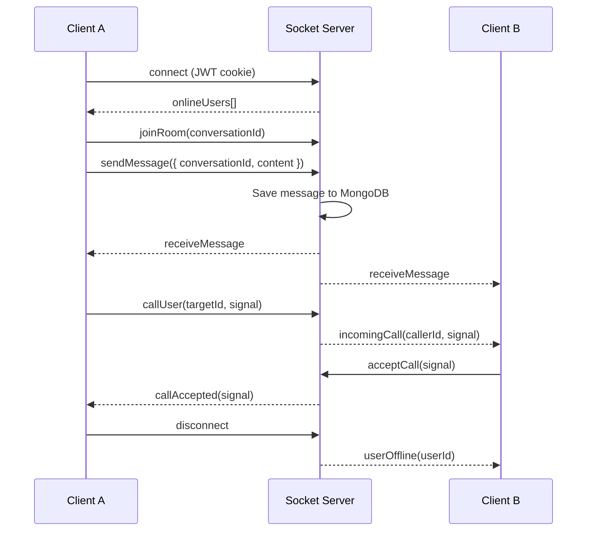

# Backend — `backend/`

The backend is a **Node.js + Express 5** server that serves REST APIs and manages real-time communication via **Socket.io**. It is deployed as a serverless function on Vercel.

## Tech Stack

| Technology | Version | Purpose |
|-----------|---------|---------|
| Node.js | LTS (ESM) | Runtime |
| Express | 5.x | REST framework |
| Socket.io | 4.x | Real-time WebSocket events |
| Mongoose | 9.x | MongoDB ODM |
| JWT (jsonwebtoken) | 9.x | Stateless authentication |
| Passport + passport-github2 | 0.7.x | GitHub OAuth 2.0 |
| Bcryptjs | 3.x | Password hashing |
| Cloudinary | 2.x | Image/media upload & storage |
| Nodemailer | 8.x | Email (verification, password reset) |
| Winston | 3.x | Structured logging |
| Vitest | 4.x | Unit testing |

## Directory Structure

```
backend/
├── main.js               # Entry: creates Express + HTTP server, registers all middleware & routes
│
├── config/
│   ├── passport.js           # GitHub OAuth strategy setup
│   └── cloudinary.js         # Cloudinary SDK initialisation
│
├── db/
│   └── ConnectDB.js          # mongoose.connect() to MongoDB Atlas
│
├── auth/
│   └── Auth.js               # JWT sign() / verify() utility helpers
│
├── middleware/
│   └── auth.middleware.js    # Verifies JWT from HttpOnly cookie → attaches req.user
│
├── service/
│   └── Nodemailer.js         # Nodemailer transporter (email verification & password reset)
│
├── socket/
│   └── socket.js             # Socket.io initialisation, online-user map, all real-time event handlers
│
├── models/                   # Mongoose data models
│   ├── user.model.js
│   ├── message.model.js
│   ├── conversation.model.js
│   ├── group.model.js
│   └── friendRequest.model.js
│
├── routes/                   # Express routers (URL prefix → controller mapping)
│   ├── auth.routes.js
│   ├── profile.routes.js
│   ├── message.routes.js
│   ├── group.routes.js
│   ├── friend.routes.js
│   └── dashboard.routes.js
│
├── controllers/              # Business logic — one file per domain
│   ├── auth.controller.js        # Register, Login, Logout, OAuth callback, email verify, PW reset
│   ├── profile.controller.js     # Get/update profile, avatar upload (Cloudinary), delete account
│   ├── message.controller.js     # Send & retrieve messages in a conversation
│   ├── group.controller.js       # Create group, add/remove members
│   ├── friend.controller.js      # Send/accept/reject/remove friend requests
│   └── dashboard.controller.js   # Dashboard stats & recent conversations
│
└── tests/                    # Vitest unit tests
    └── ...
```

## REST API Reference

### Authentication — `/api/auth`

| Method | Path | Auth Required | Description |
|--------|------|:---:|-------------|
| POST | `/register` | ✗ | Register a new user (email + password) |
| POST | `/login` | ✗ | Login; sets JWT HttpOnly cookie |
| POST | `/logout` | ✓ | Clears JWT cookie |
| GET | `/github` | ✗ | Initiates GitHub OAuth flow |
| GET | `/github/callback` | ✗ | GitHub OAuth callback → JWT cookie |
| POST | `/verify-email` | ✗ | Verify email with token |
| POST | `/forgot-password` | ✗ | Send password reset email |
| POST | `/reset-password` | ✗ | Reset password with token |

### Profile — `/api/profile`

| Method | Path | Description |
|--------|------|-------------|
| GET | `/` | Get current user's profile |
| PUT | `/update` | Update display name, bio |
| PUT | `/avatar` | Upload new avatar (Cloudinary) |
| PUT | `/change-email` | Change email address |
| PUT | `/change-password` | Change password |
| DELETE | `/delete` | Delete account permanently |

### Messages — `/api/messages`

| Method | Path | Description |
|--------|------|-------------|
| GET | `/:conversationId` | Get messages in a conversation |
| POST | `/send` | Send a new message |

### Groups — `/api/groups`

| Method | Path | Description |
|--------|------|-------------|
| GET | `/` | Get all groups for current user |
| POST | `/create` | Create a new group |
| PUT | `/:groupId/add` | Add a member to a group |
| DELETE | `/:groupId/remove` | Remove a member from a group |

### Friends — `/api/friends`

| Method | Path | Description |
|--------|------|-------------|
| GET | `/` | Get friend list |
| POST | `/request` | Send a friend request |
| PUT | `/accept` | Accept a friend request |
| PUT | `/reject` | Reject a friend request |
| DELETE | `/remove` | Remove a friend |

### Dashboard — `/api/dashboard`

| Method | Path | Description |
|--------|------|-------------|
| GET | `/` | Get stats & recent conversations |

## Real-Time — Socket.io

All real-time events flow through `socket/socket.js`. An **in-memory Map** tracks online users (`userId → socketId`).



### Socket Events

| Direction | Event | Description |
|-----------|-------|-------------|
| Client → Server | `joinRoom` | Join a conversation room |
| Client → Server | `sendMessage` | Send a chat message |
| Client → Server | `callUser` | Initiate a video call (WebRTC signal) |
| Client → Server | `acceptCall` | Accept incoming call (WebRTC answer) |
| Server → Client | `receiveMessage` | Deliver a new chat message |
| Server → Client | `incomingCall` | Notify of an incoming call |
| Server → Client | `callAccepted` | Confirm call was accepted |
| Server → Client | `onlineUsers` | Full list of currently online user IDs |
| Server → Client | `userOffline` | Notify a user has disconnected |

## Database Models

```mermaid
erDiagram
    User {
        ObjectId _id PK
        string username
        string email
        string password
        string avatar
        string bio
        boolean isVerified
        string githubId
        date createdAt
    }
    Conversation {
        ObjectId _id PK
        ObjectId[] participants
        ObjectId lastMessage
        date updatedAt
    }
    Message {
        ObjectId _id PK
        ObjectId sender FK
        ObjectId conversation FK
        string content
        string type
        date createdAt
    }
    Group {
        ObjectId _id PK
        string name
        ObjectId admin FK
        ObjectId[] members
        string avatar
    }
    FriendRequest {
        ObjectId _id PK
        ObjectId from FK
        ObjectId to FK
        string status
    }

    User ||--o{ Message : "sends"
    User ||--o{ Conversation : "participates in"
    Conversation ||--o{ Message : "contains"
    User ||--o{ Group : "admin of"
    Group }o--o{ User : "members"
    User ||--o{ FriendRequest : "sends or receives"
```



## Running Locally

```bash
cd backend
cp .env.example .env    # fill in your secrets
npm install
npm start               # nodemon main.js → http://localhost:5000
```

## Running Tests

```bash
cd backend
npm test                # vitest run (single pass)
npm run test:watch      # vitest watch mode
```
