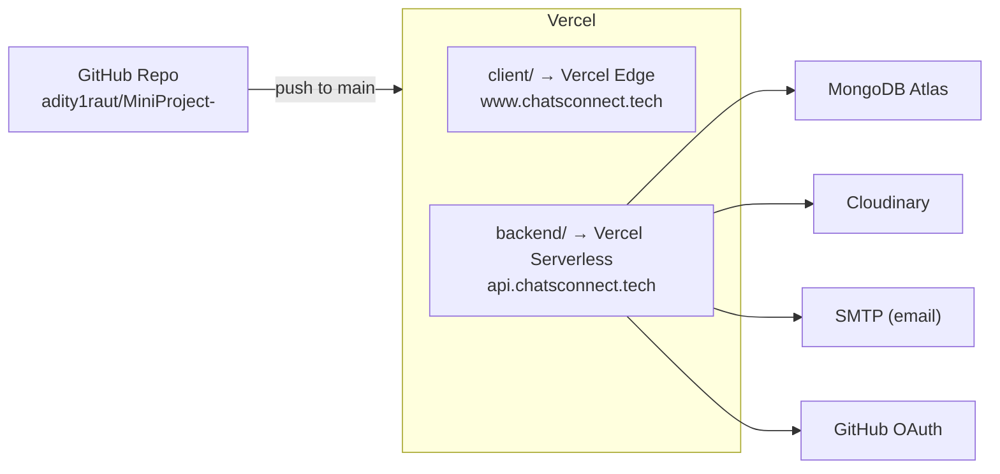

# Deployment

Both the frontend and backend are deployed on **Vercel**. The live site is accessible at **[chatsconnect.tech](https://www.chatsconnect.tech)**.

## Deployment Topology



## Deployed URLs

| Component | URL |
|-----------|-----|
| Frontend | `https://www.chatsconnect.tech` |
| Backend API | Vercel serverless (configured via `VITE_BACKEND_URL`) |

## Frontend Deployment (`client/`)

The frontend is a **Vite static SPA** deployed directly to Vercel.

**`client/vercel.json`** configures SPA fallback routing (all paths return `index.html`):

```json
{
  "rewrites": [{ "source": "/(.*)", "destination": "/index.html" }]
}
```

### Build & Deploy Steps

```bash
# Vercel auto-runs these on push:
cd client
npm install
npm run build        # Output: dist/
```

### Frontend Environment Variables

Set these in the Vercel dashboard under **Project → Settings → Environment Variables**:

| Variable | Description | Example |
|----------|-------------|---------|
| `VITE_BACKEND_URL` | Deployed backend base URL | `https://your-api.vercel.app` |

:::info
Vite only exposes variables prefixed with `VITE_` to the browser bundle.
:::

## Backend Deployment (`backend/`)

The backend is deployed as a **Node.js serverless function** on Vercel.

**`backend/vercel.json`** routes all requests through `main.js`:

```json
{
  "version": 2,
  "builds": [{ "src": "main.js", "use": "@vercel/node" }],
  "routes": [{ "src": "/(.*)", "dest": "/main.js" }]
}
```

### Backend Environment Variables

Set all of these in the Vercel dashboard:

| Variable | Description |
|----------|-------------|
| `MONGO_URI` | MongoDB Atlas connection string |
| `JWT_SECRET` | Secret key for signing JWTs |
| `CLIENT_URL` | Frontend URL (for CORS) e.g. `https://www.chatsconnect.tech` |
| `NODE_ENV` | Set to `production` |
| `CLOUDINARY_CLOUD_NAME` | Cloudinary cloud name |
| `CLOUDINARY_API_KEY` | Cloudinary API key |
| `CLOUDINARY_API_SECRET` | Cloudinary API secret |
| `GITHUB_CLIENT_ID` | GitHub OAuth app client ID |
| `GITHUB_CLIENT_SECRET` | GitHub OAuth app client secret |
| `GITHUB_CALLBACK_URL` | OAuth callback e.g. `https://api.chatsconnect.tech/api/auth/github/callback` |
| `EMAIL_USER` | SMTP sender email address |
| `EMAIL_PASS` | SMTP email password / app password |

## CORS Configuration

The backend allows requests only from whitelisted origins defined in `main.js`:

```js
const allowedOrigins = [
  process.env.CLIENT_URL,
  "https://www.chatsconnect.tech",
  ...(process.env.NODE_ENV !== "production" ? ["http://localhost:5173"] : []),
].filter(Boolean);
```

## CI/CD — GitHub Actions

The repository (`.github/`) includes GitHub Actions workflows for automated quality checks:

- **Lint**: Runs ESLint on the client on every pull request.
- **Build Check**: Runs `npm run ci` (lint + build) to catch compile errors.
- **Tests**: Runs `npm test` (Vitest) on the backend.

Merging to `main` triggers automatic Vercel deployments for both `client/` and `backend/`.

## Running Locally

```bash
# Terminal 1 — Backend
cd backend
cp .env.example .env   # fill in local values
npm install
npm start              # http://localhost:5000

# Terminal 2 — Frontend
cd client
cp .env.example .env   # set VITE_BACKEND_URL=http://localhost:5000
npm install
npm run dev            # http://localhost:5173
```

## MongoDB Atlas Setup

1. Create a free cluster on [MongoDB Atlas](https://cloud.mongodb.com).
2. Create a database user with read/write access.
3. Whitelist `0.0.0.0/0` (Vercel uses dynamic IPs) or specific Vercel IPs.
4. Copy the connection string to `MONGO_URI`.

## Cloudinary Setup

1. Create a free account at [cloudinary.com](https://cloudinary.com).
2. Copy **Cloud Name**, **API Key**, and **API Secret** from the dashboard.
3. Set them as environment variables in Vercel.
