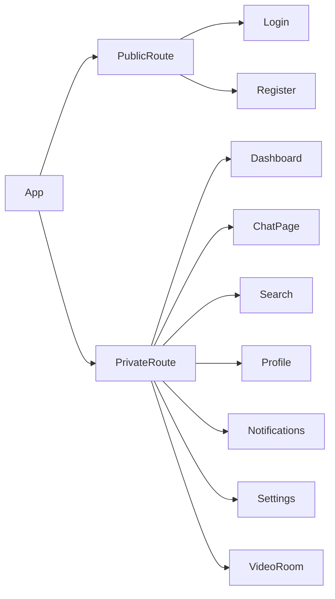

# Frontend — `client/`

The frontend is a **React 19 Single-Page Application** built with Vite, using TailwindCSS for styling and React Router 7 for navigation.

## Tech Stack

| Technology | Version | Purpose |
|-----------|---------|---------|
| React | 19 | Component-based UI rendering |
| Vite | 7 | Build tool & dev server |
| TailwindCSS | 4 | Utility-first styling (glassmorphic UI) |
| React Router | 7 | Client-side routing |
| Axios | Latest | HTTP REST API calls |
| Socket.io-client | 4.x | WebSocket real-time connection |
| Lucide React | Latest | Icon library |

## Directory Structure

```
client/src/
├── main.jsx              # Entry — wraps App in all Context providers
├── App.jsx               # Router + route definitions
├── index.css             # Global styles
├── assets/               # Static assets (images, icons)
│
├── config/
│   └── axiosConfig.js    # Axios instance (baseURL + withCredentials: true)
│
├── context/              # Global state layer (React Context API)
│   ├── AuthContext.jsx       # Logged-in user state, login/logout helpers
│   ├── SocketContext.jsx     # socket.io-client connection lifecycle
│   ├── FriendContext.jsx     # Friends list & online presence
│   ├── NotificationContext.jsx # Notification badge & events
│   ├── CallContext.jsx       # WebRTC video/audio call state machine
│   └── ThemeContext.jsx      # Dark / light theme toggle
│
├── pages/                # Route-level page components
│   ├── Login.jsx
│   ├── Register.jsx
│   ├── Dashboard.jsx
│   ├── ChatPage.jsx
│   ├── Search.jsx
│   ├── Profile.jsx
│   ├── Notification.jsx
│   ├── Settings.jsx      (stub)
│   └── VideoRoom.jsx     (stub)
│
└── components/           # Reusable UI components
    ├── auth/             # LoginForm, RegisterForm
    ├── chat/             # ChatPage, MainDashboard, CreateGroupModal, NewDMModal
    ├── profile/          # ProfilePage, ProfileSidebar, tabs, modals, Toast
    ├── video/            # VideoCallModal, IncomingCallModal
    ├── notifications/    # NotificationsPanel
    ├── common/           # Shared atoms (buttons, loaders, etc.)
    ├── ai/               # AI assistant UI
    ├── group/            # Group management UI
    └── routes/           # PrivateRoute, PublicRoute guards
```

## Routing



| Path | Page | Guard |
|------|------|-------|
| `/login` | `Login.jsx` | PublicRoute (redirects to `/dashboard` if logged in) |
| `/register` | `Register.jsx` | PublicRoute |
| `/dashboard` | `Dashboard.jsx` | PrivateRoute |
| `/chat` | `ChatPage.jsx` | PrivateRoute |
| `/search` | `Search.jsx` | PrivateRoute |
| `/profile` | `Profile.jsx` | PrivateRoute |
| `/notifications` | `Notification.jsx` | PrivateRoute |
| `/settings` | `Settings.jsx` | PrivateRoute |
| `/video-room` | `VideoRoom.jsx` | PrivateRoute |

## Context (Global State)

| Context | State Managed |
|---------|--------------|
| `AuthContext` | `user` object, `isAuthenticated`, `login()`, `logout()` |
| `SocketContext` | Socket.io connection instance, connection lifecycle |
| `FriendContext` | Friends list, online/offline status updates |
| `NotificationContext` | Notification count, friend request events |
| `CallContext` | Incoming/outgoing call state, WebRTC peer connection |
| `ThemeContext` | `theme` (dark/light), `toggleTheme()` |

## Key Components

### Chat
- **`components/chat/MainDashboard.jsx`** — Sidebar conversation list with DMs and groups.
- **`components/chat/ChatPage.jsx`** — Full message thread panel with send input.
- **`components/chat/CreateGroupModal.jsx`** — Modal for creating a new group chat.
- **`components/chat/NewDMModal.jsx`** — Modal to start a new direct message.

### Profile
The profile section is split into tabs:
- **ProfileTab** — Update display name, bio, avatar (via Cloudinary).
- **EmailTab** — Change email with verification.
- **PasswordTab** — Change password.
- **DangerZoneTab** — Delete account with confirmation modal.

### Video Calling
- **`components/video/VideoCallModal.jsx`** — Active call UI (local + remote video streams, controls).
- **`components/video/IncomingCallModal.jsx`** — Accept/decline incoming call overlay.

## Styling & Design System
- **TailwindCSS 4** with a **glassmorphic dark aesthetic** throughout.
- Fully responsive across mobile, tablet, and desktop.
- All components use Tailwind utility classes (no separate CSS files per component).

## Running Locally

```bash
cd client
npm install
npm run dev         # starts dev server on http://localhost:5173
```
