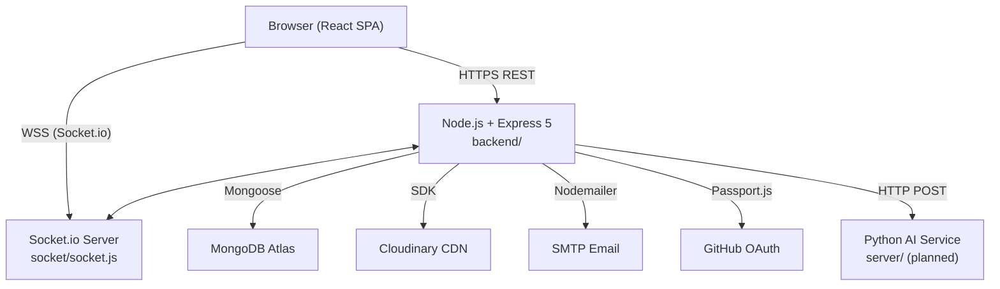
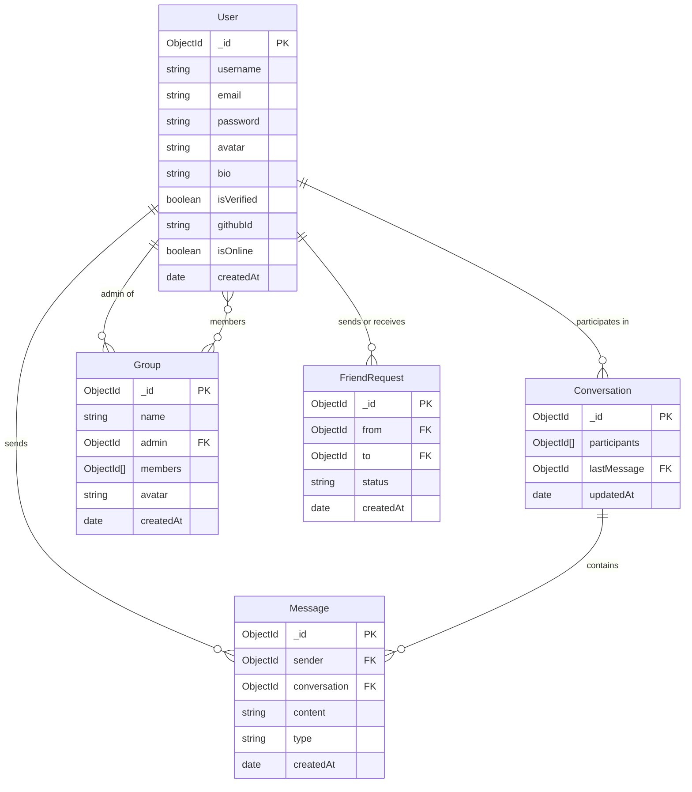
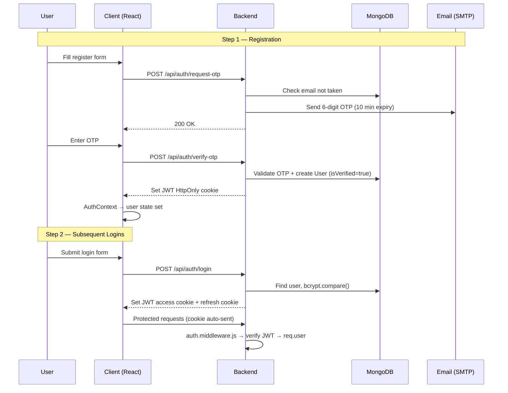
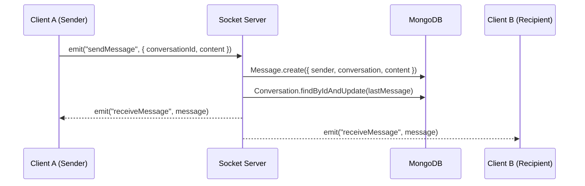
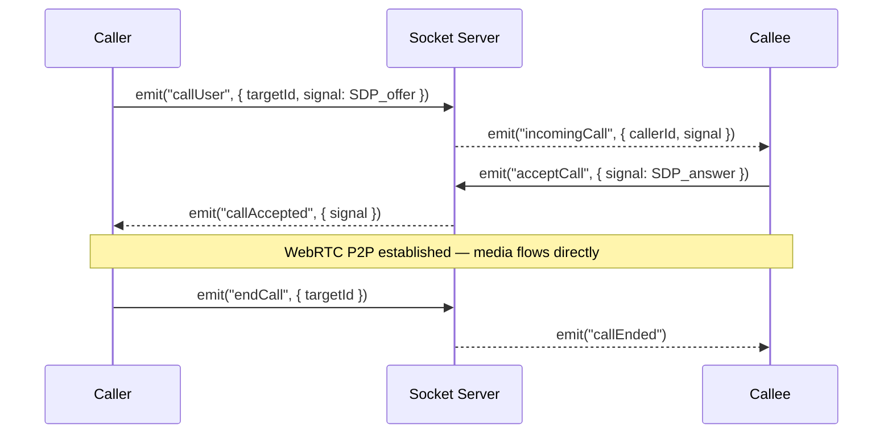
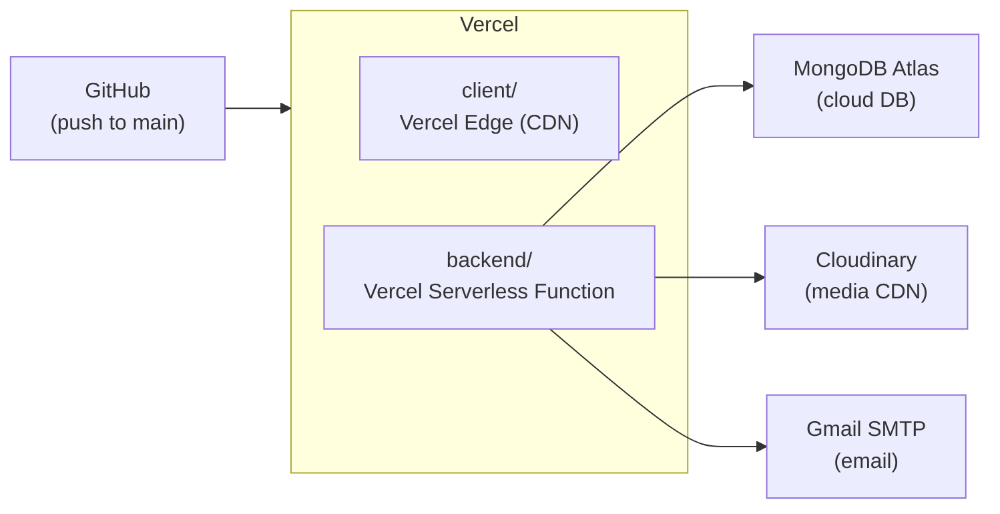

# System Design

This chapter covers the architectural decisions, module decomposition, data design, and interface contracts that translate the requirements into a working system.

---

## 1. Design Principles

| Principle | Application in ChatsConnect |
|-----------|----------------------------|
| **Separation of Concerns** | MVC-style backend (models / controllers / routes / middleware); frontend split into pages, components, and contexts |
| **Stateless Backend** | JWT in HttpOnly cookie — no server-side session state; enables horizontal scaling |
| **Single Responsibility** | Each Socket.io event handler, controller function, and React context handles exactly one domain |
| **Open / Closed** | AI microservice is a separate process with a stable HTTP contract — new AI models can be swapped without touching the Node.js backend |
| **Progressive Enhancement** | Core auth and messaging work without the AI service; AI features are additive |

---

## 2. High-Level Architecture



---

## 3. Module Decomposition

### 3.1 Backend Modules

```
backend/
├── main.js                  ← Bootstraps Express, HTTP server, Socket.io, routes
├── auth/Auth.js             ← JWT sign / verify utility
├── config/
│   ├── passport.js          ← GitHub OAuth strategy
│   └── cloudinary.js        ← Cloudinary SDK init
├── db/ConnectDB.js          ← mongoose.connect()
├── middleware/
│   └── auth.middleware.js   ← Verifies JWT cookie → req.user
├── service/
│   └── Nodemailer.js        ← SMTP transporter + email templates
├── socket/
│   └── socket.js            ← Online-user Map, all event handlers
├── models/                  ← Mongoose schemas (5 models)
├── routes/                  ← Express routers (6 route files)
├── controllers/             ← Business logic (6 controller files)
└── tests/                   ← Vitest unit tests
```

### 3.2 Frontend Modules

```
client/src/
├── config/axiosConfig.js    ← Axios instance with baseURL + credentials
├── context/                 ← 6 global state contexts
├── pages/                   ← Route-level views (Login, Register, Dashboard …)
└── components/
    ├── auth/                ← LoginForm, RegisterForm
    ├── chat/                ← MainDashboard, ChatPage, modals
    ├── profile/             ← ProfilePage, tabs (Profile, Email, Password, DangerZone)
    ├── video/               ← VideoCallModal, IncomingCallModal
    ├── notifications/       ← NotificationsPanel
    ├── group/               ← Group management
    ├── ai/                  ← AI assistant UI (planned)
    ├── common/              ← Shared atoms (buttons, loaders, toasts)
    └── routes/              ← PrivateRoute, PublicRoute guards
```

---

## 4. Database Design

### 4.1 Entity-Relationship Diagram



### 4.2 Schema Design Decisions

| Decision | Rationale |
|----------|-----------|
| `Conversation.participants` is an **array of ObjectIds** (not a join table) | MongoDB embedded arrays are O(1) to query; no JOIN needed |
| `Message.conversation` references `Conversation._id` | Keeps messages as independent documents; supports pagination with `.skip()` / `.limit()` |
| `Group.members` embedded array | Groups are small (< 500 members); querying membership doesn't need a separate collection |
| `FriendRequest` as a separate collection | Explicit status field (`pending` / `accepted` / `rejected`) allows querying all pending requests efficiently |
| `User.isVerified` boolean | Blocks login attempts until OTP is confirmed without deleting the partial user document |

---

## 5. Authentication Design



### Token Design

| Token | Storage | Expiry | Payload |
|-------|---------|--------|---------|
| Access Token | HttpOnly cookie | 15 minutes | `{ userId }` |
| Refresh Token | HttpOnly cookie | 7 days | `{ userId }` |

---

## 6. Real-Time Messaging Design

### 6.1 Room Model

Each conversation (DM or group) maps to a **Socket.io room** identified by `conversationId`. Clients join the room when they open that conversation.

```
Room: conversationId
  └── Socket IDs of all connected participants
```

### 6.2 Message Delivery Flow



### 6.3 Online Presence

An **in-memory Map** (`userId → socketId`) is maintained in `socket.js`:
- On `connect`: user's ID is added to the map; all clients receive an updated `onlineUsers` array.
- On `disconnect`: user is removed; all clients receive `userOffline(userId)`.

```js
// Simplified online-user logic
const onlineUsers = new Map();          // userId → socketId

io.on("connection", (socket) => {
  onlineUsers.set(socket.userId, socket.id);
  io.emit("onlineUsers", [...onlineUsers.keys()]);

  socket.on("disconnect", () => {
    onlineUsers.delete(socket.userId);
    io.emit("userOffline", socket.userId);
  });
});
```

---

## 7. Video Call Design (WebRTC via Socket.io Signaling)



The Socket.io server acts only as a **signaling relay** — it does not process any media. Once the WebRTC handshake completes, all audio/video flows directly between the two browsers.

---

## 8. Frontend State Architecture

The frontend uses **six React Contexts** that wrap the application in a layered provider tree:

```
AuthProvider
  └── SocketProvider (depends on auth token)
        └── FriendProvider
              └── NotificationProvider
                    └── CallProvider
                          └── ThemeProvider
                                └── <App routes />
```

| Context | State | Key Mechanism |
|---------|-------|---------------|
| `AuthContext` | `user`, `isAuthenticated` | Reads JWT cookie on mount; exposes `login()`, `logout()` |
| `SocketContext` | `socket` instance | Opens Socket.io connection when user is authenticated; closes on logout |
| `FriendContext` | `friends[]`, `onlineUsers[]` | Listens to `onlineUsers` and `userOffline` socket events |
| `NotificationContext` | `unreadCount`, `notifications[]` | Listens to `receiveMessage`; increments badge count |
| `CallContext` | `incomingCall`, `callAccepted`, peer stream | State machine: `idle → ringing → in-call → ended` |
| `ThemeContext` | `theme` (`dark`/`light`) | Persisted to `localStorage`; toggles Tailwind dark class |

---

## 9. API Design Summary

All REST endpoints follow the convention `POST` for mutations, `GET` for reads, `PUT` for updates, `DELETE` for removals. Every protected route requires a valid JWT cookie verified by `auth.middleware.js`.

| Domain | Base Path | Key Endpoints |
|--------|-----------|---------------|
| Auth | `/api/auth` | `POST /login`, `POST /verify-otp`, `GET /github`, `POST /refresh-token` |
| Profile | `/api/profile` | `GET /me`, `PUT /update`, `PUT /update-email`, `DELETE /delete` |
| Messages | `/api/messages` | `GET /:conversationId`, `POST /send`, `GET /conversations` |
| Groups | `/api/groups` | `GET /my`, `POST /create`, `PUT /:id/add`, `DELETE /:id/remove` |
| Friends | `/api/friends` | `POST /request`, `PUT /accept`, `PUT /reject`, `DELETE /remove` |
| Dashboard | `/api/dashboard` | `GET /` (stats + recent conversations) |

See the [Backend](./backend) page for full endpoint tables.

---

## 10. Security Design

| Threat | Mitigation |
|--------|-----------|
| Password theft | bcryptjs hash (salt rounds = 10) — plaintext never stored |
| XSS cookie theft | JWT stored in `HttpOnly` cookie — inaccessible to JavaScript |
| CSRF | `SameSite=Strict` cookie attribute; CORS whitelist restricts origins |
| Credential brute-force | OTP time expiry (10 min); planned: rate limiting middleware |
| Unauthenticated socket access | Socket.io middleware extracts and verifies JWT before `connection` event fires |
| Insecure media upload | Cloudinary upload signed with API secret server-side — client never holds the secret |

---

## 11. Deployment Design



See the [Deployment](./deployment) page for environment variables, CI/CD pipeline, and local setup.

---

:::tip UML Diagrams
For formal Use Case, Class, Sequence, and Activity diagrams see the [UML Diagrams](./uml-diagrams) page.
:::
